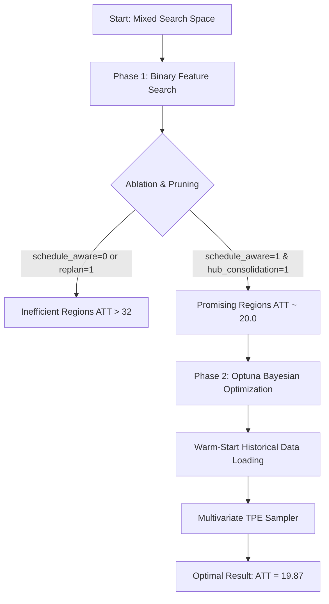

# Parameter Optimization Strategy — WSC 2026

This document details the methodology and algorithmic design used to optimize response strategies in the maritime simulator, successfully reducing the Average Transport Time (ATT) of cargo from an unoptimized initial value of **~24.7** and **20.01** (initial best binary config) to a record minimum of **19.87**.

---

## 1. The Challenge of Optimizing Expensive Simulations

Tuning hyperparameters in this simulation presents two key complexities:
1. **High Computational Cost:** Each full simulation run (140 days of warm-up + 360 days of measurement) takes approximately **14.5 minutes** of CPU time. This completely rules out brute-force grid searches or massive genetic algorithms that require thousands of iterations.
2. **Mixed Search Space:** The strategy contains discrete structural variables (binary flags that toggle modules on/off) and continuous numerical hyperparameters (penalty weights, time margins, buffers).

---

## 2. Two-Phase Methodology

To solve this in a time-efficient manner, we designed a hierarchical optimization approach:

### Phase 1: Structural Pruning (Binary Search)
Using `parameter_tuner.py`, we evaluated combinations of the 7 main binary modules of the strategy.
* **Key Finding:** The analysis of trial logs revealed a critical correlation. Activating both `schedule_aware_booking` and `hub_transfer_consolidation` is mandatory to maintain system stability (bringing ATT down to the ~20.0 range). Disabling schedule-guided bookings shoots the ATT up to **32.08 - 34.78**.
* **Result:** This allowed us to **freeze** the optimal structural architecture (Trial 11), drastically reducing the search space dimensions for the next phase.

### Phase 2: Bayesian Optimization (Fine-Tuning Continuous Weights)
Using `bayesian_tuner.py`, we implemented a Bayesian optimizer utilizing the **Optuna** library to tune the continuous and discrete parameter spaces.

#### Key Features of the Optimizer:
1. **Warm-Start:** The optimizer reads the `trials.csv` file from Phase 1 upon initialization. It automatically translates previously evaluated binary combinations into valid trials for the probabilistic estimator. This avoids wasting the first 10-15 runs (typically spent on random exploration in Optuna) and immediately accelerates exploitation.
2. **Multivariate TPE (Tree-structured Parzen Estimator) Sampler:** Unlike standard TPE, this model estimates joint probability distributions among multiple continuous variables, dynamically adapting to the simulation's sensitivity.
3. **Persistence and Graceful Interruptions:** Progress is saved in SQLite (`study.db`). If interrupted via keyboard (`Ctrl+C`), the script gracefully stops the current run, saves the state, and allows resuming the experiment seamlessly from the same iteration in the future.

---

## 3. Analysis of the Optimal Configuration (Trial 63 - ATT: 19.87)

After running the Bayesian optimizer, trial #63 achieved a global average ATT of **19.87** with an extremely low period standard deviation of **0.88** (indicating high stability and predictability of the network under disruption events).

The tuned parameter adjustments are detailed below:

### A. Booking Configuration and Time Windows
* **`booking_min_headway_days = 2.5`** and **`booking_max_headway_days = 10.5`**: The optimizer narrowed the booking window (previously `2.0` to `12.0` days). This prevents cargo from reserving space too far in advance on unstable routes during disruption events, improving last-minute cargo flexibility.
* **`booking_handling_buffer_days = 0.35`** (previously `0.25`): Increasing the handling buffer provides a time cushion for cargo at transshipment ports, mitigating vessel connection delays.
* **`booking_min_direct_saving_days = 0.75`** (previously `1.0`): Lowering the threshold to prefer direct routes allows booking direct shipments even with marginal savings of less than a day, freeing up capacity at transshipment hubs.

### B. Congestion Penalties and Alternative Routing
* **`expected_route_wait_days = 5.5`** (previously `3.5`): The model learned to proactively overestimate the wait time on congested routes. This deters the routing planner from sending containers through saturated routes unless it is the only option.
* **`congestion_risk_penalty_days = 1.8`** (previously `2.4`): By slightly lowering this generic risk penalty and increasing the specific wait time estimate (`expected_route_wait_days`), the algorithm makes decisions based on actual port congestion data rather than static risk penalties.
* **`route_pressure_penalty_days = 1.4`** (previously `1.9`): Allows more flexibility to accept routes with moderate space pressure if the overall transit time remains optimal.
* **`closed_port_risk_penalty_days = 11.0`** (previously `9.0`): Severely penalizes routes that transit through ports currently closed due to disruptions, preventing severe bottlenecks.

---

## 4. Conclusion

The combination of **heuristic pruning in Phase 1** (to fix the binary structure) and **Bayesian TPE optimization in Phase 2** (to tune continuous variables) proved to be a highly effective approach. It enabled fine-tuning a slow simulator with high precision, finding an optimal balance between consolidation at transshipment hubs and dynamic avoidance of port congestion.
