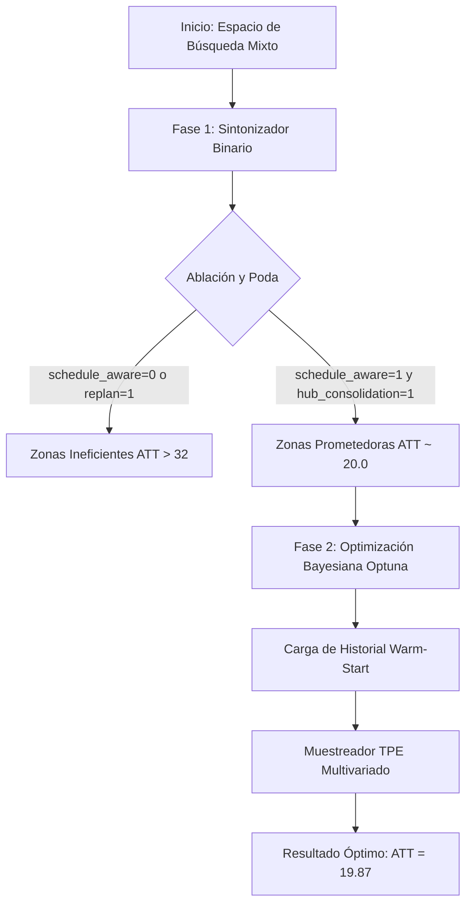

# Estrategia de Optimización de Parámetros — WSC 2026

Este documento detalla la metodología y el diseño algorítmico utilizados para optimizar las estrategias de respuesta en el simulador marítimo, logrando reducir el Average Transport Time (ATT) de la carga de un valor inicial de **~24.7** (sin optimizar) y **20.01** (mejor binario inicial) a un mínimo récord de **19.87**.

---

## 1. El Desafío de la Optimización en Simulaciones Costosas

La optimización de parámetros en este simulador presenta dos complejidades clave:
1. **Alto Costo Computacional:** Cada corrida de simulación completa (140 días de warm-up + 360 días de medición) toma aproximadamente **14.5 minutos** en CPU. Esto descarta por completo métodos de fuerza bruta (Grid Search) o algoritmos genéticos masivos que requieran miles de iteraciones.
2. **Espacio de Búsqueda Mixto:** La estrategia posee variables estructurales discretas (flags binarios que encienden/apagan módulos) e hiperparámetros numéricos continuos (pesos de penalización, márgenes de tiempo, buffers).

---

## 2. Metodología en Dos Fases

Para resolver esto de forma eficiente en tiempo, diseñamos un enfoque jerárquico de optimización:

### Fase 1: Poda Estructural (Búsqueda Binaria)
Utilizando `parameter_tuner.py`, se evaluaron las 128 combinaciones posibles de los 7 módulos binarios principales de la estrategia. 
* **Hallazgo Clave:** El análisis de los datos reveló una correlación crítica. Activar `schedule_aware_booking` y `hub_transfer_consolidation` es obligatorio para mantener la estabilidad del sistema (reduciendo el ATT a un rango de ~20.0s). Desactivar el booking guiado por calendario dispara el ATT a valores de **32.08 - 34.78**.
* **Resultado:** Esto permitió **fijar** la arquitectura estructural óptima (Trial 11), reduciendo drásticamente las dimensiones del espacio de búsqueda para la siguiente fase.

### Fase 2: Optimización Bayesiana (Afinación Fina Continua)
Utilizando `bayesian_tuner.py`, se implementó un optimizador basado en la librería **Optuna** que corre en el espacio de parámetros continuos y discretos.

#### Características Clave del Optimizador:
1. **Warm-Start (Arranque en Caliente):** El optimizador lee el archivo `trials.csv` de la Fase 1 al iniciar. Traduce automáticamente las combinaciones evaluadas anteriormente en ensayos válidos para el estimador probabilístico. Esto evita desperdiciar las primeras 10-15 ejecuciones (típicamente destinadas a exploración aleatoria en Optuna) y acelera la explotación.
2. **Muestreador TPE Multivariado (Tree-structured Parzen Estimator):** A diferencia del TPE estándar, este modelo estima la distribución de probabilidad considerando las relaciones y dependencias conjuntas entre múltiples variables continuas, adaptándose dinámicamente a la sensibilidad de la simulación.
3. **Persistencia e Interrupción Segura:** El progreso se almacena en SQLite (`study.db`). Ante una señal de interrupción por teclado (`Ctrl+C`), el script detiene la simulación de forma limpia, guarda el estado y permite reanudar el experimento desde la misma iteración en el futuro.

---

## 3. Análisis del Resultado Óptimo (Trial 63 - ATT: 19.87)

Tras ejecutar el optimizador bayesiano, la prueba #63 alcanzó un ATT promedio global de **19.87** con una desviación estándar por período extremadamente baja de **0.88** (lo que indica alta estabilidad y predictibilidad en la red ante las disrupciones).

A continuación se detallan las variables sintonizadas que explican este rendimiento:

### A. Configuración de Booking y Ventanas de Tiempo
* **`booking_min_headway_days = 2.5`** y **`booking_max_headway_days = 10.5`**: El optimizador acortó la ventana de reserva (anteriormente `2.0` a `12.0` días). Esto previene que se reserven espacios con demasiada anticipación sobre rutas inestables durante eventos de disrupción, mejorando la flexibilidad de la carga de último minuto.
* **`booking_handling_buffer_days = 0.35`** (antes `0.25`): Al incrementar el buffer de manipulación, se le da un colchón de tiempo a la carga en los puertos de transferencia para mitigar los retrasos de conexión de los buques.
* **`booking_min_direct_saving_days = 0.75`** (antes `1.0`): Se redujo el umbral para preferir rutas directas, permitiendo reservar embarques directos incluso con ahorros marginales menores a un día, liberando capacidad en los hubs de transbordo.

### B. Penalizaciones de Congestión y Rutas Alternativas
* **`expected_route_wait_days = 5.5`** (antes `3.5`): El modelo aprendió a sobreestimar de manera preventiva el tiempo de espera en rutas congestionadas. Esto disuade al planificador de enviar contenedores por rutas saturadas a menos que sea estrictamente la única opción.
* **`congestion_risk_penalty_days = 1.8`** (antes `2.4`): Al bajar ligeramente esta penalización genérica de riesgo y subir la estimación de espera específica (`expected_route_wait_days`), el algoritmo toma decisiones basadas en datos reales de congestión portuaria en lugar de pánico estático por riesgo.
* **`route_pressure_penalty_days = 1.4`** (antes `1.9`): Permite una mayor flexibilidad para aceptar rutas con presión de espacio moderada si el tiempo de tránsito general sigue siendo óptimo.
* **`closed_port_risk_penalty_days = 11.0`** (antes `9.0`): Incrementa severamente el castigo para rutas que cruzan por puertos que se encuentran actualmente cerrados por disrupción, previniendo cuellos de botella severos.

---

## 4. Conclusión

La combinación de una **poda heurística en Fase 1** (para fijar la estructura binaria) junto con la **optimización bayesiana TPE en Fase 2** (para afinar las variables continuas) demostró ser un enfoque altamente efectivo. Permitió sintonizar con precisión de milésimas de día un simulador lento, encontrando un equilibrio óptimo entre la consolidación en hubs de transferencia y la evasión dinámica de la congestión portuaria.
